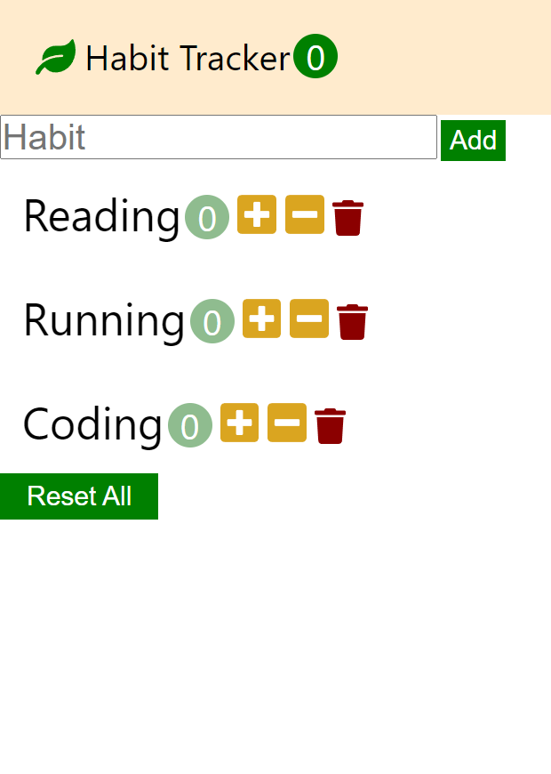

## [Dream Coding] Habit tracker app clone coding practice

---

### 🖥️ 강의명

드림코딩 - 리액트 개념 정리 + 유튜브 클론 코딩 외 실전 프로젝트 완성

### 🔥 수강 목표

1. 첫번째 프로젝트인 Habit Tracker 앱을 구현해 리액트의 기초적인 개념들에 대한 이해와 사용을 익히기.

2. 리액트 전반에 대한 흐름 익히기

3. 실무자의 리액트 사용방식에 대한 실질적 팁 익히기

### ✨ Habit Tracker 기능 소개

1. Header 부분에 생성된 습관의 수를 표시

2. 인풋 상자에 새로운 습관을 입력하고 Add 버튼을 누르면 새로운 습관 생성

3. 형성된 습관들 리스트를 확인할 수 있음

   - 습관 이름 / count / ➕ 버튼 (count 증가) / ➖버튼 (count 감소) / 🗑️ 버튼 (습관 삭제)

4. Reset All 버튼을 클릭하여 생성된 습관들의 count를 모두 초기화 할 수 있음

---

### 예시 화면

